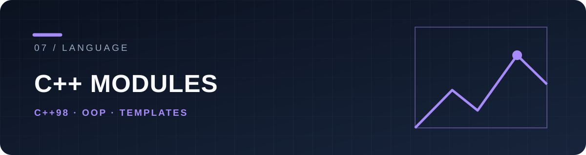

# C++ Modules · 42

A collection of 42 curriculum exercises from **Module 00 through Module 09**. Each module contains separate programs and Makefiles; this is a learning collection, not a single application.

## Learning path

| Modules | Main ideas |
| --- | --- |
| 00–01 | Classes, encapsulation, allocation, references and pointers |
| 02–04 | Canonical form, operator overloads, inheritance and polymorphism |
| 05–07 | Exceptions, casts and templates |
| 08–09 | Containers, algorithms and more complex data structures |

The exercises target **C++98** and generally compile with `-Wall -Wextra -Werror -std=c++98`. Individual exercise rules can be stricter; consult their local instructions.

## Explore or build

Browse [Module 00](CPP%20Module%2000) through [Module 09](CPP%20Module%2009), select an `exNN` folder, and run its own Makefile:

```sh
cd "CPP Module 00/ex00"
make
```

The executable name varies by exercise. This repository shows progression across object lifetime, interfaces and generic programming. The code is coursework, so each folder should be assessed on its own merits. [License](LICENSE).
